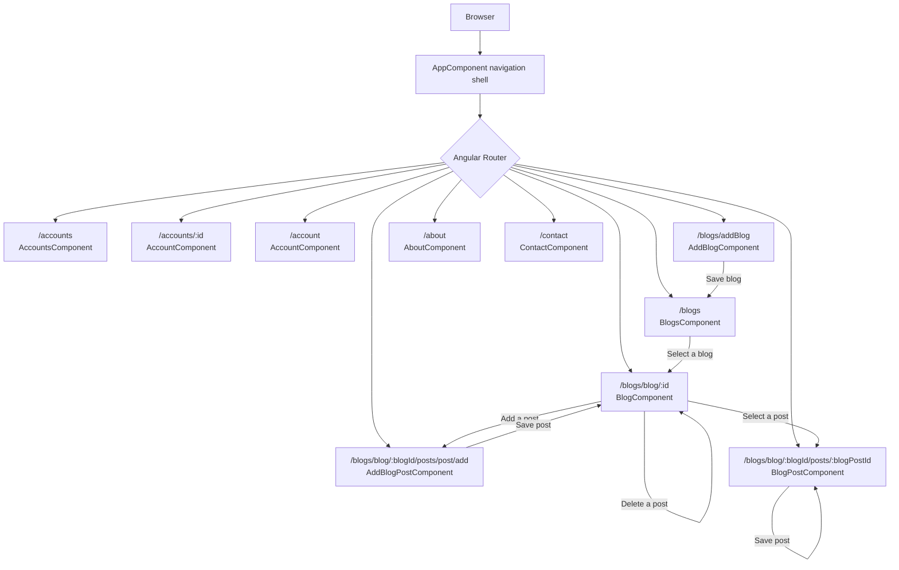
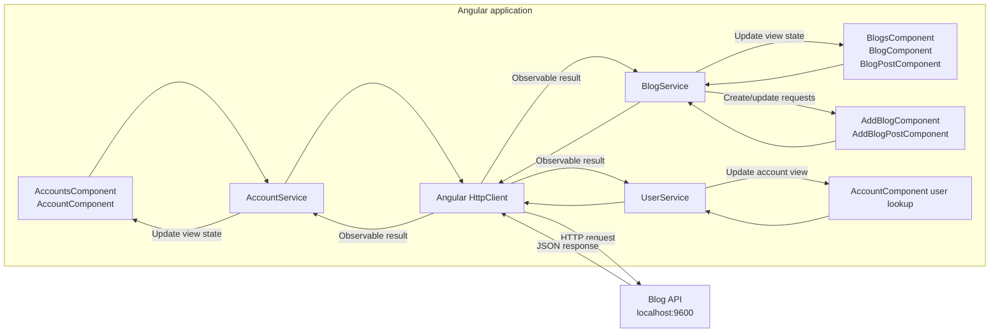

# Application Flow

## Navigation

The browser loads the Angular shell. The router displays the selected page inside `AppComponent`'s router outlet. Blog and account actions are handled by their feature components.

## Data Requests

Feature components call injectable services. Services use Angular `HttpClient` to exchange JSON with the separate API currently configured at `http://localhost:9600`.

## Main Operations

| User action | Component | Service operation |
| --- | --- | --- |
| Open the blog list | `BlogsComponent` | `BlogService.getBlogs()` |
| Open a blog | `BlogComponent` | `getBlogsById()` and `getBlogPostsByBlogId()` |
| Open a post | `BlogPostComponent` | `getBlogPostByBlogId()` |
| Create a blog | `AddBlogComponent` | `BlogService.addBlog()` |
| Create a post | `AddBlogPostComponent` | `BlogService.addBlogPost()` |
| Edit or remove a post | `BlogPostComponent` or `BlogComponent` | `saveBlogPost()` or `deleteBlogPost()` |
| View accounts | `AccountsComponent` | `AccountService.getAccounts()` |
| View account details | `AccountComponent` | `getAccountsById()` and `UserService.getUserById()` |
