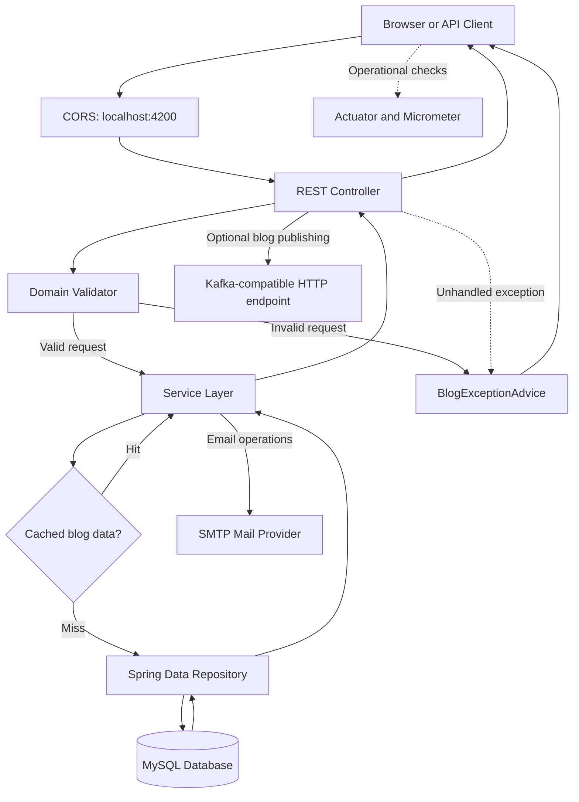

# Blog Application Request Flow

## Flow notes

1. A client sends an HTTP request to one of the REST controllers.
2. Controllers validate request data before calling the service layer.
3. Blog reads can use the cache; cache misses are delegated to Spring Data repositories.
4. Repositories read from or write to the configured database.
5. Valid responses return through the controller to the client.
6. Application exceptions are converted into HTTP responses by `BlogExceptionAdvice`.
7. Blog publishing, email, and operational metrics are optional integrations.
