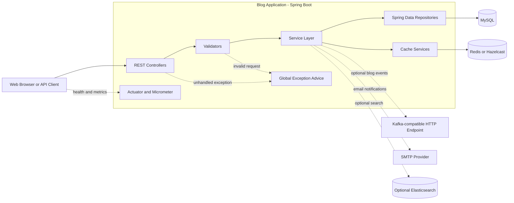

# Blog Application High-Level Architecture

## Boundaries

- **Client boundary:** Browser or API consumers call the REST endpoints on port `9600`.
- **Web boundary:** Controllers map HTTP requests for blogs, posts, comments, users, and accounts.
- **Application boundary:** Validators, services, caching, exception handling, and observability coordinate application behavior.
- **Persistence boundary:** Spring Data repositories access MySQL through JPA.
- **Integration boundary:** Redis/Hazelcast, the Kafka-compatible endpoint, SMTP, and Elasticsearch are optional external dependencies.
